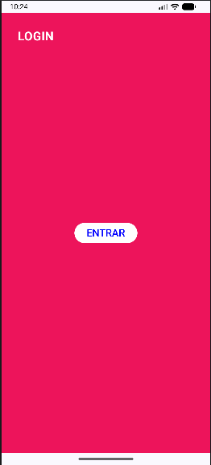
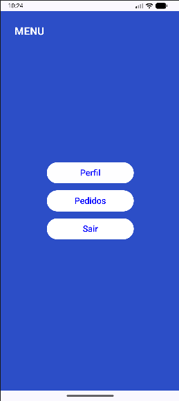
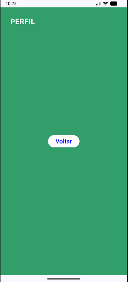
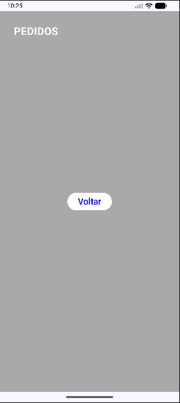

# 📱 Navigation Compose App

## 📌 Descrição
Este projeto foi desenvolvido como atividade prática para compreender a navegação entre telas utilizando o Navigation Compose no Android.

A proposta foi recriar manualmente a evolução de um projeto existente, acompanhando seus commits e implementando cada etapa do processo.

---

## 🚀 Funcionalidades
- Tela de Login
- Tela de Menu
- Navegação entre telas
- Acesso às telas de Perfil e Pedidos
- Estrutura com Navigation Compose

---

## 🧠 Aprendizados
- Uso do NavController
- Configuração de NavHost
- Criação de rotas entre telas
- Organização de código com Jetpack Compose

---

## 📸 Prints do aplicativo

### Tela de Login

### Tela de Menu

### Navegação entre telas

---

## 🔗 Repositório
Projeto desenvolvido para fins acadêmicos.